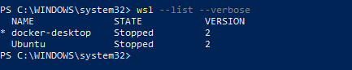
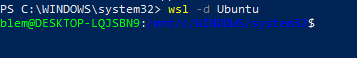
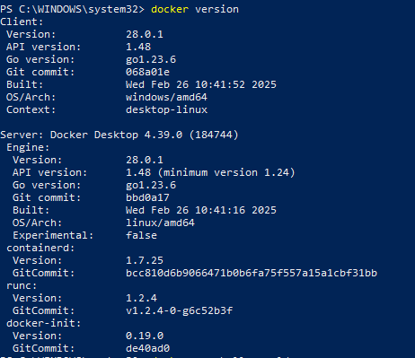
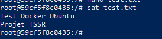
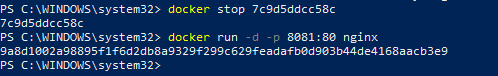
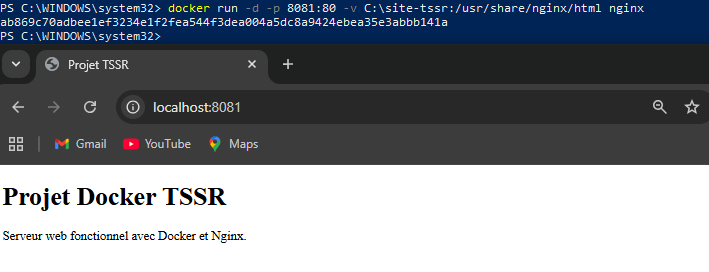

# Projet Linux / Docker

## Présentation générale

Ce projet a été réalisé dans le cadre d’une préparation personnelle avant l’entrée en formation **Technicien Supérieur Systèmes et Réseaux (TSSR)**.

---

## Environnement technique

Le projet repose sur l’environnement suivant :

- **Système hôte :** Windows 10
- **Sous-système Linux :** WSL2
- **Distribution utilisée :** Ubuntu
- **Outil de conteneurisation :** Docker Desktop for Windows
- **Serveur web déployé :** Nginx

---

## Déroulement du projet

## 1. Vérification de l’environnement de départ

La première étape a consisté à vérifier que l’environnement nécessaire au projet était bien présent.

Le but était de vérifier que :

- **WSL** était bien installé
- une distribution Linux pouvait être identifiée
- l’environnement Windows permettait la suite des manipulations

---

## 2. Prise en main d’Ubuntu via WSL2

Une fois la vérification faite, le projet s’est poursuivi avec l’utilisation d’**Ubuntu** via **WSL2**.

Cette étape a permis de :

- lancer un environnement Linux depuis Windows
- accéder à un terminal Linux
- commencer à manipuler Ubuntu
- utiliser un environnement Linux depuis Windows

---

## 3. Premières manipulations sous Linux

Après le lancement d’Ubuntu, le projet a continué avec les premières manipulations dans l’environnement Linux.

Le but était de prendre une première base sur :

- la navigation dans le terminal
- la logique des commandes
- la structure de l’environnement Linux
- la manipulation de fichiers et de répertoires
- l’usage des droits administrateur dans certaines opérations

---

## 4. Installation de Docker Desktop

Après les premières manipulations sous Linux, le projet s’est orienté vers l’installation de **Docker Desktop**.

Cette étape avait pour but de :

- installer l’outil de conteneurisation
- vérifier qu’il s’intègre correctement à l’environnement
- préparer la suite du projet avec les premiers conteneurs

---

## 5. Vérification du fonctionnement de Docker

Après l’installation, une phase de vérification a été faite pour confirmer que Docker fonctionnait correctement.

Le but était de vérifier que :

- Docker était bien installé
- le moteur Docker fonctionnait
- les commandes passaient correctement
- l’environnement était prêt à lancer des conteneurs

---

## 6. Premières manipulations avec les conteneurs

Une fois Docker validé, le projet a continué avec les premières manipulations de conteneurs.

Cette partie a permis de mieux comprendre :

- la différence entre une **image** et un **conteneur**
- le fait qu’un conteneur est lancé à partir d’une image
- qu’un conteneur peut être exécuté, arrêté, supprimé et relancé
- que Docker permet de travailler dans un environnement isolé du système principal

---

## 7. Utilisation de Docker Hub

Le projet s’appuie aussi sur **Docker Hub**, utilisé pour récupérer des images prêtes à l’emploi.

Cette étape a permis de :

- récupérer une image existante
- identifier son utilité
- l’exécuter correctement
- l’utiliser dans le cadre du projet

---

## 8. Déploiement d’un serveur web Nginx

L’étape centrale du projet a été le déploiement d’un serveur **Nginx** dans un conteneur Docker.

À ce stade, le projet ne consistait plus seulement à vérifier Docker, mais à lancer un vrai service accessible localement.

---

## 9. Test du service dans le navigateur

Après le lancement du conteneur Nginx, l’objectif a été de vérifier que le service était bien accessible dans le navigateur.

Cette étape a permis de confirmer que :

- le conteneur était bien lancé
- le service était bien exposé
- il était accessible localement
- le comportement attendu était bien présent

---

## 10. Personnalisation du contenu servi

Le projet ne s’est pas limité au lancement d’un Nginx par défaut.

Il a aussi intégré une **page HTML personnalisée** servie par Nginx.

Cette partie a permis de mieux comprendre :

- le lien entre les fichiers locaux et le service dans le conteneur
- la logique d’un serveur web simple
- la manière dont un contenu peut être servi par Nginx

---

## 11. Difficultés rencontrées

Le projet a aussi comporté plusieurs difficultés techniques.

Parmi les problèmes rencontrés :

- **conflits de ports**
- **erreur HTTP 403**
- **chemin de volume incorrect**

Cette partie a demandé de :

- repérer le problème
- chercher d’où il venait
- tester des corrections
- valider le résultat

---

## 12. Résolution des conflits de ports

Le conflit de ports a permis de mieux comprendre qu’un service peut être bloqué si le port utilisé entre en conflit avec autre chose dans l’environnement local.

Cela a permis de mieux comprendre :

- la notion de port local
- la notion de port exposé
- le lien entre la machine hôte et le conteneur

---

## 13. Résolution de l’erreur 403

L’erreur **403 Forbidden** a obligé à vérifier plusieurs points :

- la présence du contenu attendu
- le bon chemin vers les fichiers
- la cohérence générale de la configuration
- le fait que Nginx pouvait réellement servir ce contenu

---

## 14. Correction d’un chemin de volume incorrect

Le problème de chemin de volume incorrect a permis de mieux comprendre la liaison entre :

- la machine hôte
- les fichiers locaux
- le conteneur
- le service exécuté à l’intérieur

Cette étape a surtout montré qu’une erreur de chemin peut suffire à bloquer le résultat attendu.

---

## Rapport complet

Le rapport détaillé du projet est disponible en version PDF :

- [Rapport complet — version PDF](docs/rapport-complet.pdf)

---

## Captures

